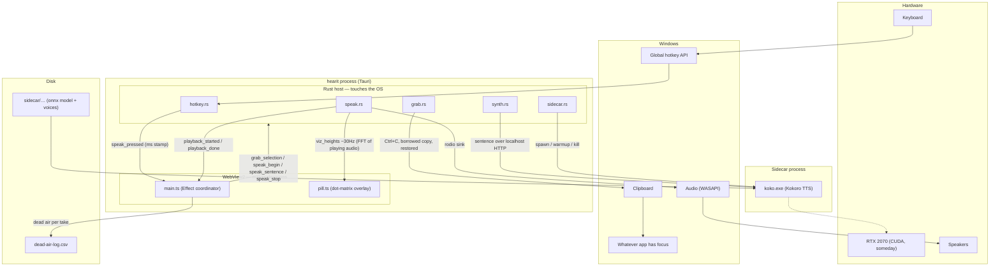

# Architecture — how hearit sits in the machine

One diagram, kept honest: if the code and this drawing disagree, one of
them is a bug. See the north star for why the shape is this way.

Three sentences that summarize the whole design:

1. **Rust touches the OS, TS makes decisions, the sidecar thinks** — the
   same contract as sayit, because it's the same house. Every arrow
   between the webview and Rust is either an event up or a command down.
2. The four pipeline stages (hotkey → grab → synthesize → play) never
   talk to each other — text and audio flow forward through the
   coordinator, and each stage can be replaced without the others
   noticing. The streaming unit is the sentence: dead air is measured
   against the first one only.
3. Everything stays on this machine: the model is a child process on
   localhost, the selection dies with the take, and the only artifacts
   are sound in the air and a row in dead-air-log.csv.

## Cancellation, because a reader you can't stop is an alarm

Two counters, one on each side of the IPC seam:

- **TS (`genRef`)** — a newer press invalidates any sentence loop still
  running for an older one, so we stop *asking* for synthesis.
- **Rust (`Takes`)** — `speak_begin`/`speak_stop` bump it;
  `speak_sentence` refuses to enqueue audio whose take token is stale, so
  a sentence that was mid-synthesis when you pressed stop comes back,
  matches a dead token, and lands on the floor instead of the speaker.

The sink itself is stopped natively (`speak.rs`), never via a webview
round-trip — silence on demand is one Rust call. The pill's X does both:
`invoke("speak_stop")` for instant silence, then `emit("pill_stop")` so
the coordinator cleans up.

## The pill is honest

`speak.rs` taps every sample bound for the sink into a ring buffer, runs
a 1024-point FFT over it ~30×/s, folds the result into 32 log-spaced
speech bands (80Hz–5kHz), quantizes to 6 rows with hysteresis, and emits
`viz_heights`. The pill draws those heights and nothing else — what you
see pulsing is what the speaker is playing, at cell resolution. Design
decisions for the grid (rows, bands, colors, max-not-mean, no peak hold)
are locked per the spectrum-grid handoff notes in the pill prototypes.
